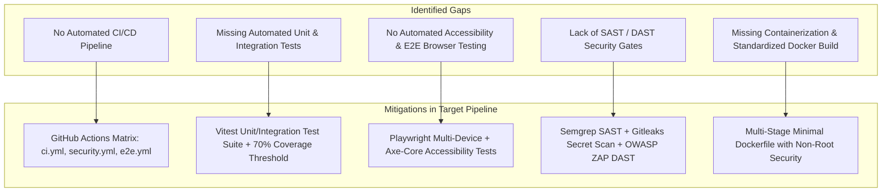

# Comprehensive CI/CD & Security Architecture Audit

**Project**: Chandrapura Kidney Care (Super-Speciality Hospital Website)  
**Lead Architect & DevOps Engineer**: Antigravity CI/CD & Security Team  
**Date**: September 2026  
**Status**: Production-Ready Audit Complete

---

## 1. Executive Summary

Chandrapura Kidney Care is a super-speciality hospital web portal dedicated to Nephrology, Dialysis, Kidney Transplantation, and Laser Urology services led by Dr. Sagar Damodar Sarda in Chandrapur, Maharashtra.

This audit evaluates the codebase architecture, data flow, application security posture, existing testing gaps, and deployment pipelines to establish an automated, enterprise-grade, and healthcare-compliant CI/CD pipeline.

---

## 2. Existing Architecture Analysis

### A. Technology Stack

| Layer                 | Component                      | Version / Technology    | Observations                                                 |
| --------------------- | ------------------------------ | ----------------------- | ------------------------------------------------------------ |
| **Frontend**          | React SPA                      | React 18.3.1            | Single-Page Application bootstrapped with Vite 5.4           |
| **Styling & UI**      | Tailwind CSS + Lucide Icons    | Tailwind 3.4.17         | Clean, responsive design, custom animations                  |
| **3D Graphics**       | Three.js & Canvas              | Three.js 0.186.0        | Interactive 3D Kidney & Bladder anatomical viewers           |
| **State & i18n**      | React Context                  | Native Context API      | Multi-language (English, Marathi, Hindi) with `localStorage` |
| **Backend API**       | Node.js Express REST API       | Express 4.21.2          | Lightweight REST API running on port 5000                    |
| **Database**          | Embedded SQLite                | `better-sqlite3` 11.8.1 | Synchronous, zero-latency WAL-mode SQLite database           |
| **Package Manager**   | npm                            | Monorepo Structure      | Root orchestrator with `client/` and `server/`               |
| **Hosting & Serving** | Express Static + SPA Catch-All | Node.js Runtime         | Express serves `client/dist` static assets and API routes    |

### B. Core Application Features

1. **Interactive Anatomy Explorer**: 3D interactive model rendering for Nephrology (Kidneys/Adrenal/Renal Artery) and Urology (Bladder/Prostate/Urethra).
2. **Real-Time OPD Queue**: Live token tracking (`/api/opd/queue`) polling every 8 seconds, dynamically showing current token in consultation, next available token, and doctor status.
3. **Automated Slot Locking**: Online appointment scheduling (`/api/appointments`) with automatic prevention of duplicate bookings for the same date and time slot.
4. **Doctor & Staff Portal**: PIN/passcode-protected clinical portal (`/api/auth/login`) with rate-limiting, session token validation, token queue controls, and patient inquiry management.
5. **Multi-Language Knowledge Hub**: 38 categorized FAQs across Nephrology and Urology in English, Marathi, and Hindi.

---

## 3. Risk Assessment & Gap Analysis

### Key Risk Factors

1. **Patient Data & Form Security**: Patient appointment forms collect names, phone numbers, and clinical complaints. Inputs must be strictly validated, sanitized, and protected from CSRF/XSS and injection attacks.
2. **Administrative Access**: The Doctor Portal manages appointments and real-time OPD tokens. It requires cryptographic session management, brute-force mitigation, and zero exposure of secrets in client bundles.
3. **Double-Booking & Race Conditions**: Concurrency protection in SQLite for appointment slots.
4. **Availability & Resilience**: The hospital's emergency dialysis and contact numbers must remain accessible 24/7 with zero downtime deployments and automated rollback capabilities.

---

## 4. Pipeline Stages & Tool Selection

| Stage                             | Target Objective                                 | Selected Tooling                    | Enforcement Level               |
| --------------------------------- | ------------------------------------------------ | ----------------------------------- | ------------------------------- |
| **A. Repository Validation**      | Validate lockfiles, configs, no `.env` tracked   | Custom Shell / Node check           | **BLOCKING (Must Pass)**        |
| **B. Dependency Cache & Install** | Deterministic `npm ci` across monorepo           | `actions/cache@v4` + `npm ci`       | **BLOCKING**                    |
| **C. Linting & Formatting**       | Prevent syntax, type, and formatting errors      | ESLint + Prettier                   | **BLOCKING**                    |
| **D. Unit Testing & Coverage**    | Test business logic, calculators, translations   | Vitest + v8 Coverage (≥70%)         | **BLOCKING**                    |
| **E. API Integration Testing**    | Test DB queries, slot locking, auth endpoints    | Supertest + SQLite Memory/Test DB   | **BLOCKING**                    |
| **F. E2E & Cross-Browser**        | Validate patient flows (Desktop, Mobile, Tablet) | Playwright Test                     | **BLOCKING**                    |
| **G. Accessibility (a11y)**       | Ensure WCAG 2.1 AA healthcare compliance         | `@axe-core/playwright`              | **BLOCKING (Critical/Serious)** |
| **H. Secret Scanning**            | Detect leaked API keys, tokens, credentials      | `gitleaks/gitleaks-action`          | **BLOCKING**                    |
| **I. SAST Code Analysis**         | Detect SQLi, XSS, insecure DOM, SSRF             | `returntocorp/semgrep`              | **BLOCKING (High/Critical)**    |
| **J. Dependency Audit**           | Detect vulnerable npm dependencies               | `npm audit --audit-level=high`      | **BLOCKING (High/Critical)**    |
| **K. Container Security**         | Minimal non-root image, scan OS packages         | Docker + Aqua Trivy Scanner         | **BLOCKING (Critical)**         |
| **L. DAST Vulnerability Scan**    | Dynamic scan of staging endpoints                | OWASP ZAP Baseline Scan             | **WARNING / REPORTING**         |
| **M. Deployment Gates**           | Zero-downtime deployment + rollback              | GitHub Environments + Health Checks | **BLOCKING**                    |

---

## 5. Required GitHub Secrets & Environment Variables

### A. GitHub Secrets Configuration (Repository Settings ➔ Secrets and variables ➔ Actions)

| Secret Name                               | Description                                               | Used In Workflow                              | Sensitive? |
| ----------------------------------------- | --------------------------------------------------------- | --------------------------------------------- | ---------- |
| `ADMIN_SECRET_PASSCODE`                   | Master Doctor Portal administrative password              | `deploy-production.yml`, `server`             | Yes 🔒     |
| `DEPLOY_SSH_KEY` / `SERVER_SSH_KEY`       | Private SSH key for production/staging server deployment  | `deploy-staging.yml`, `deploy-production.yml` | Yes 🔒     |
| `STAGING_HOST` / `PROD_HOST`              | Hostname or IP address of the target server               | Deployment workflows                          | Yes 🔒     |
| `DEPLOY_USER`                             | Remote SSH deploy user (e.g. `deploy` / `ubuntu`)         | Deployment workflows                          | No         |
| `SLACK_WEBHOOK_URL` / `TEAMS_WEBHOOK_URL` | Optional notification webhook for pipeline failure alerts | All workflows                                 | Yes 🔒     |

### B. GitHub Environment Variables

| Variable Name  | Environment          | Value / Purpose                            |
| -------------- | -------------------- | ------------------------------------------ |
| `NODE_ENV`     | Staging / Production | `production`                               |
| `PORT`         | Staging / Production | `5000` (or target container port)          |
| `VITE_APP_URL` | Staging              | `https://staging.chandrapurakidneycare.in` |
| `VITE_APP_URL` | Production           | `https://chandrapurakidneycare.in`         |

---

## 6. Assumptions & Limitations

- **Node.js Runtime**: Pipeline assumes Node.js 20.x LTS or 22.x LTS environment on GitHub Actions runners (`ubuntu-latest`).
- **Database Scope**: SQLite WAL-mode is ideal for single-instance high-performance hospital setups; persistent volumes must be mounted when containerized.
- **Regulatory Advisory**: This audit implements industry best practices (DISHA / ISO 27001 / HIPAA principles); formal legal compliance reviews should be verified by certified compliance auditors before storing full Electronic Health Records (EHR).
